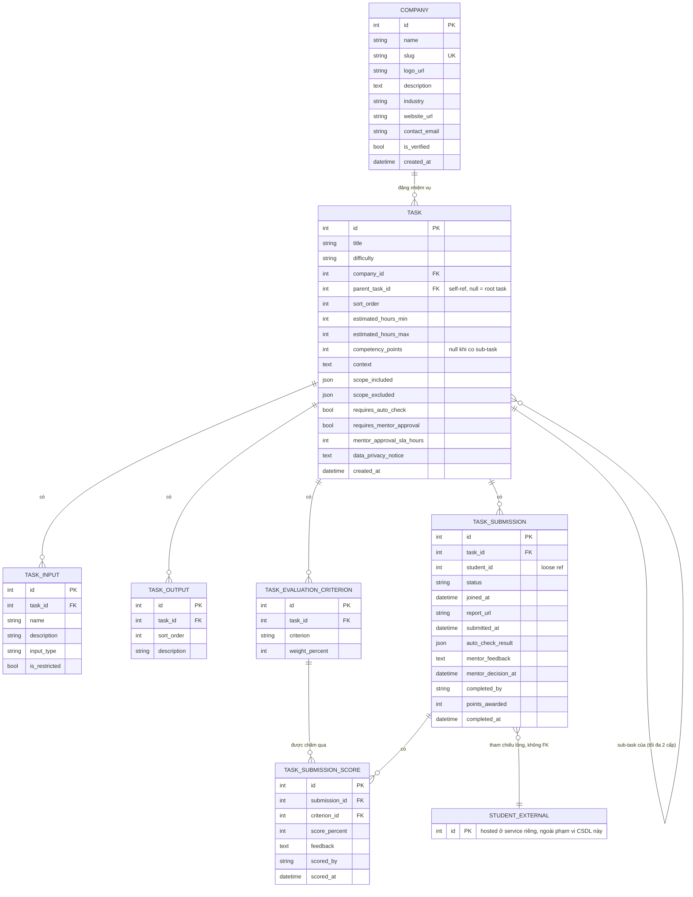

# Data Model: Task (Nhiệm vụ) — WORKLAB

Phân tích data model cho tính năng "Nhiệm vụ" — nhiệm vụ thực hành do doanh nghiệp tài trợ mà học sinh/sinh viên tham gia để rèn kỹ năng và tích luỹ điểm năng lực, dựa trên màn hình chi tiết nhiệm vụ (WORKLAB — "Hệ thống hướng nghiệp", cùng concept với `career-guidance-backend`).

**Phạm vi tài liệu này**: chỉ phân tích/thiết kế data model (markdown), **chưa implement code**.

## Quyết định thiết kế đã chốt

- **Company** là entity riêng (bảng `Company`), không phải string field trên `Task` — vì nhiều nhiệm vụ có thể cùng thuộc 1 công ty, và công ty có thể cần thêm thuộc tính (logo, mô tả...) sau này.
- **Student được host ở service/API riêng, tách biệt.** `TaskSubmission` chỉ tham chiếu `student_id` như một **ID tham chiếu lỏng** — không dùng FK cứng trong cùng CSDL, không join trực tiếp. Vì lý do này, liên kết Task ↔ Skill/Career (thuộc domain `market`/`student` hiện tại) được **giữ ngoài phạm vi** ở giai đoạn này, tránh tạo coupling ngược khi Student sắp tách domain.
- **Workflow được model đầy đủ trạng thái** (không chỉ là catalog tĩnh): Tham gia → Nộp kết quả → Auto-Check → Mentor phê duyệt → Hoàn thành.
- **Ghi nhận điểm năng lực vào hồ sơ** có actor rõ ràng thực hiện: mentor là người review/duyệt task, nhưng hành động "submit" ghi nhận điểm ở bước Hoàn thành có thể do **AI** (hệ thống tự động, khi task không yêu cầu review thủ công) hoặc do **mentor** (chủ động submit sau khi duyệt) thực hiện — không phải một sự kiện hệ thống ngầm định.
- **Task hỗ trợ sub-task**: không tạo entity riêng — sub-task là một row `Task` bình thường, tự tham chiếu về task cha qua `parent_task_id` (self-referential FK). Nhờ vậy sub-task tự động có đầy đủ workflow/`TaskSubmission` riêng như mọi Task khác, không cần logic nộp/duyệt riêng biệt. Giới hạn **tối đa 2 cấp** (Task → Sub-task; một task đã có `parent_task_id` thì không được làm cha của task khác) — validate ở service layer, không phải DB constraint.
- **Điểm năng lực cộng dồn từ sub-task**: khi 1 task có sub-task, `competency_points` của chính nó không dùng — tổng điểm học sinh nhận được = tổng `points_awarded` từ các `TaskSubmission` **đã `COMPLETED`** của từng sub-task (tính tại thời điểm đọc, không phải giá trị catalog tĩnh cộng sẵn), để phản ánh đúng những gì học sinh thực sự đã hoàn thành.
- **Bỏ `category`**: không model thành field/enum trên `Task`. Danh mục nhiệm vụ hiện chưa cần quản lý độc lập; nếu phát sinh nhu cầu thật sẽ xem xét lại (vd. đổi sang bảng lookup như `Skill`).
- **`autonomy_level` luôn luôn là "Guided"**: đây là giá trị bất biến, không thực sự biến đổi theo từng task ở giai đoạn hiện tại — nên **không lưu thành cột/enum trong DB**. Nếu UI cần hiển thị "Có hướng dẫn (Guided)" thì đó là text tĩnh ở tầng trình bày.

## 1. Entities

### `Company` — doanh nghiệp tài trợ nhiệm vụ

| field | type | ghi chú |
|---|---|---|
| id | PK | |
| name | str(255) | vd. "Tiki Corporation" |
| slug | str(255), unique, indexed | định danh dạng URL-friendly (vd. `tiki-corporation`), dùng cho route công khai kiểu `/companies/{slug}` mà không lộ id nội bộ |
| logo_url | str, nullable | hiển thị cạnh tên công ty ở header nhiệm vụ (icon 🏢 trên UI) |
| description | text, nullable | giới thiệu ngắn về doanh nghiệp, hiển thị ở trang profile công ty |
| industry | str(100), nullable | ngành nghề hoạt động (vd. "E-commerce") — field mô tả tự do, **không** phải FK tới `Career`/`Skill` của domain `market` (giữ Task độc lập theo quyết định đã chốt) |
| website_url | str, nullable | |
| contact_email | str, nullable | đầu mối liên hệ khi cần trao đổi về nhiệm vụ (không phải tài khoản đăng nhập) |
| is_verified | bool, default `false` | doanh nghiệp đã được xác minh danh tính hay chưa — quan trọng để học sinh tin tưởng khi nộp báo cáo/dữ liệu cho một "công ty"; nhiệm vụ của công ty chưa verify có thể cần ẩn khỏi trang chủ hoặc gắn nhãn cảnh báo (business rule, không phải DB constraint) |
| created_at | datetime | |

### `Task` — catalog nhiệm vụ

| field | type | ghi chú |
|---|---|---|
| id | PK | |
| title | str(255) | "Phân tích Hành vi Giỏ hàng E-commerce" |
| difficulty | enum `TaskDifficulty` | `EASY` / `MEDIUM` / `HARD` ("Trung bình") |
| company_id | FK → `Company.id` | |
| parent_task_id | Optional[int], FK → `Task.id`, nullable, indexed | null = task gốc/độc lập; có giá trị = đây là sub-task. Chính task cha (task được trỏ tới) **không được** có `parent_task_id` khác null — giới hạn tối đa 2 cấp, validate ở service layer |
| sort_order | int, default 0 | thứ tự hiển thị giữa các sub-task cùng cha |
| estimated_hours_min / estimated_hours_max | int | "Ước tính: 4-6 giờ" — cùng pattern range số nguyên như `JobPosting.salary_min/max` đã có trong domain `market` |
| competency_points | int, **nullable** | "+50 Điểm năng lực" — bắt buộc khi task không có sub-task (leaf); để `null` khi task có sub-task, vì điểm lúc đó được tính cộng dồn từ `points_awarded` của các sub-task đã `COMPLETED` (xem "Quyết định thiết kế") |
| context | text | nội dung mục "Bối cảnh" |
| scope_included | JSON (list[str]) | các gạch đầu dòng ✅ trong "Phạm vi" |
| scope_excluded | JSON (list[str]) | các gạch đầu dòng ❌ (gạch ngang) trong "Phạm vi" |
| requires_auto_check | bool | task này có bước Auto-Check hay không |
| requires_mentor_approval | bool | task này có bước Mentor phê duyệt hay không |
| mentor_approval_sla_hours | int, nullable | "SLA: 48h" |
| data_privacy_notice | text | đoạn "Quy định Bảo mật Dữ liệu" |
| created_at | datetime | |

`scope_included`/`scope_excluded` dùng JSON thay vì bảng con riêng: đây chỉ là danh sách mô tả dạng bullet, không cần query/join theo từng dòng — cùng tinh thần với `Student.ai_inferred_profile` (JSON cho dữ liệu mô tả không cần truy vấn độc lập).

### `TaskInput` — "Đầu vào (Inputs)" (1 Task → N Input)

| field | type | ghi chú |
|---|---|---|
| id | PK | |
| task_id | FK → `Task.id` | |
| name | str | "checkout_events_q3.csv" |
| description | str | "Tập dữ liệu 50k+ dòng (Đã ẩn danh)" |
| input_type | enum (`DATASET`, `DOCUMENT`, `OTHER`) | khớp icon khác nhau trong UI (dataset vs tài liệu) |
| is_restricted | bool | icon khoá trên UI — có thể nghĩa là "chỉ mở khi đã tham gia nhiệm vụ" |

### `TaskOutput` — "Kết quả mong đợi" (1 Task → N Output)

| field | type | ghi chú |
|---|---|---|
| id | PK | |
| task_id | FK → `Task.id` | |
| sort_order | int | thứ tự hiển thị (1, 2, ...) |
| description | str | vd. "Một báo cáo Slide (PDF) tối đa 5 trang..." |

### `TaskEvaluationCriterion` — "Tiêu chí đánh giá & Hoàn thành"

| field | type | ghi chú |
|---|---|---|
| id | PK | |
| task_id | FK → `Task.id` | |
| criterion | str | vd. "Xác định đúng các Drop-off point..." |
| weight_percent | int | tổng các criterion của cùng 1 task nên = 100% — đây là business rule, validate ở service layer chứ không phải DB constraint |

### `TaskSubmission` — tiến trình 1 student tham gia 1 Task (bảng trạng thái)

| field | type | ghi chú |
|---|---|---|
| id | PK | |
| task_id | FK → `Task.id` | |
| student_id | int, indexed | **tham chiếu lỏng, không FK** — Student ở service khác |
| status | enum `SubmissionStatus` | xem state machine bên dưới |
| joined_at | datetime | thời điểm bấm "Tham gia nhiệm vụ" |
| report_url | str, nullable | link báo cáo học sinh nộp |
| submitted_at | datetime, nullable | |
| auto_check_result | JSON, nullable | kết quả kiểm tra định dạng tự động (pass/fail + lý do) |
| mentor_feedback | text, nullable | |
| mentor_decision_at | datetime, nullable | thời điểm mentor review & duyệt |
| completed_by | enum (`AI`, `MENTOR`), nullable | actor thực hiện hành động submit ghi nhận điểm — `AI` khi task không yêu cầu mentor và auto-check pass, `MENTOR` khi mentor chủ động submit sau khi duyệt |
| points_awarded | int, nullable | copy từ `Task.competency_points` **tại thời điểm hoàn thành** (immutable snapshot — không đọc lại `Task` sau này, tránh trường hợp task đổi điểm số làm sai lệch lịch sử) |
| completed_at | datetime, nullable | thời điểm `completed_by` thực hiện submit |

### `TaskSubmissionScore` — kết quả đánh giá theo từng tiêu chí (1 Submission → N Score)

`TaskEvaluationCriterion` chỉ là rubric (định nghĩa tiêu chí + trọng số cho cả Task) — bảng này mới là nơi lưu **kết quả chấm thật** cho một lượt nộp cụ thể, theo từng tiêu chí. Không có bảng này thì không có chỗ nào ghi "submission X đạt bao nhiêu điểm ở tiêu chí Y".

| field | type | ghi chú |
|---|---|---|
| id | PK | |
| submission_id | FK → `TaskSubmission.id` | |
| criterion_id | FK → `TaskEvaluationCriterion.id` | |
| score_percent | int (0–100) | mức đạt được trên tiêu chí này |
| feedback | text, nullable | nhận xét riêng cho tiêu chí đó |
| scored_by | enum (`AI`, `MENTOR`) | ai chấm tiêu chí này (auto-check có thể tự chấm 1 số tiêu chí, mentor chấm phần còn lại) |
| scored_at | datetime | |

Điểm tổng của 1 submission = `Σ(criterion.weight_percent × score.score_percent / 100)` qua tất cả `TaskSubmissionScore` của submission đó — **tính tại thời điểm đọc**, không lưu cột tổng riêng (tránh 2 nguồn dữ liệu lệch nhau, cùng tinh thần với cách tính điểm cộng dồn sub-task).

**State machine của `status`:**

```
JOINED → SUBMITTED → AUTO_CHECK_PASSED ─┐
                    └→ AUTO_CHECK_FAILED  (quay lại SUBMITTED sau khi học sinh nộp lại)
                                          ├→ MENTOR_APPROVED → COMPLETED
                                          └→ MENTOR_REJECTED  (quay lại SUBMITTED)
```

Nếu `Task.requires_mentor_approval = false`, luồng có thể đi thẳng `AUTO_CHECK_PASSED → COMPLETED` với `completed_by = AI`.

## 2. ERD



`STUDENT_EXTERNAL` chỉ để minh hoạ — không phải bảng thật trong CSDL của domain `task`, đại diện cho service Student tách riêng mà `TaskSubmission.student_id` trỏ tới bằng ID thường (không constraint FK).

Tóm tắt quan hệ dạng chữ, cho người không xem được Mermaid:

```
Company (1) ──< (N) Task
Task    (1) ──< (N) TaskInput
Task    (1) ──< (N) TaskOutput
Task    (1) ──< (N) TaskEvaluationCriterion
Task    (1) ──< (N) TaskSubmission
Task    (1) ──< (N) Task            (self-ref: parent_task_id, tối đa 2 cấp)
TaskSubmission          (1) ──< (N) TaskSubmissionScore
TaskEvaluationCriterion (1) ──< (N) TaskSubmissionScore
TaskSubmission.student_id  ─ ─ ─ (tham chiếu lỏng, ngoài CSDL) ─ ─ ─>  Student (service riêng)
```

## 3. Enum tổng hợp

| Enum | Giá trị |
|---|---|
| `TaskDifficulty` | `EASY`, `MEDIUM`, `HARD` |
| `TaskInputType` | `DATASET`, `DOCUMENT`, `OTHER` |
| `SubmissionStatus` | `JOINED`, `SUBMITTED`, `AUTO_CHECK_PASSED`, `AUTO_CHECK_FAILED`, `MENTOR_APPROVED`, `MENTOR_REJECTED`, `COMPLETED` |
| `CompletionActor` | `AI`, `MENTOR` — tái dùng cho cả `TaskSubmission.completed_by` và `TaskSubmissionScore.scored_by` |

(`TaskCategory` và `AutonomyLevel` đã bị loại khỏi model — xem "Quyết định thiết kế đã chốt".)

## 4. Giả định cần xác nhận thêm

- **Mentor cụ thể**: UI chưa cho thấy entity "Mentor/User" — `completed_by`/`mentor_feedback` hiện chỉ phân biệt *loại* actor (AI vs Mentor), chưa gắn `mentor_id` cụ thể. Nếu cần audit theo từng mentor (ai duyệt task nào), sẽ cần thêm entity `Mentor` và FK riêng.
- **Ghi nhận điểm năng lực** là một lời gọi ra ngoài tới service Student (event hoặc API call, kích hoạt bởi hành động submit của `completed_by`) — không ghi trực tiếp vào bảng nào trong hệ này, vì Student đã tách domain.

## 5. Nếu triển khai vào codebase hiện tại (tham khảo, không bắt buộc)

Nếu implement, đây sẽ là domain mới `app/domains/task/`, theo đúng cấu trúc DDD đã dùng cho `market`/`student`/`guidance` (`models.py` / `schemas.py` / `repository.py` / `service.py` / `router.py`), đăng ký vào `main.py` theo "Wiring rule" đã ghi trong [IMPLEMENTATION_PLAN.md](IMPLEMENTATION_PLAN.md). Vì `student_id` là tham chiếu lỏng (không FK), domain `task` sẽ không cần import trực tiếp `domains.student` như cách `guidance` hiện đang làm — giữ đúng ranh giới tách biệt đã thống nhất.
